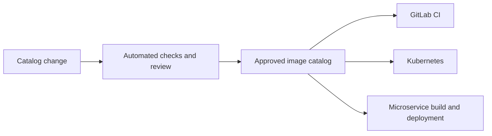

# Images Foundry

Images Foundry is a single source of truth for container images that are approved for use across the software development lifecycle (SDLC).

## Problem

An SDLC contains several actors that use container images, including Kubernetes workloads, GitLab CI pipelines, and microservices. Today, each actor maintains its own image list and rules. This creates duplicated configuration, inconsistent versions, unclear ownership, and no reliable way to answer a basic question: **which container images are allowed in our systems?**

The current approach makes it difficult to:

- prevent unapproved or vulnerable images from being used;
- keep image versions consistent across environments and tools;
- understand where an image is used and who owns it;
- update or retire an image safely;
- audit image approvals and policy changes.

## Proposed solution

Images Foundry will provide one version-controlled catalog of allowed container images. The catalog on the `main` branch is the source of truth. Every image will have a canonical, machine-readable record containing its immutable digest, ownership, permitted use cases, lifecycle status, and relevant security metadata.

SDLC actors will consume or validate against the same published catalog instead of maintaining independent allowlists.



Images Foundry is a policy and inventory layer. It does not replace a container registry, CI platform, Kubernetes, or a vulnerability scanner.

## Goals

- Maintain one authoritative inventory of allowed container images.
- Identify deployable images by immutable digest rather than by mutable tag alone.
- Apply consistent image policy across CI, Kubernetes, and microservice workflows.
- Make every approval, update, deprecation, and removal reviewable and auditable.
- Support automated validation and straightforward integration with existing tools.
- Provide a controlled migration path when an approved image is replaced or retired.

## Repository model

The MVP uses Git as both the change-control system and the audit log:

- `main` contains the effective catalog and must always be valid;
- direct pushes to `main` are disabled;
- any contributor may propose an image through a pull or merge request;
- required owners review the proposal before it is merged;
- CI validates the catalog and verifies the proposed image;
- merging publishes a new immutable catalog snapshot for consumers.

An entry in an open pull or merge request is a proposal. It does not become allowed until the change is approved, merged into `main`, and published. Approval information comes from the reviewed Git change; contributors must not approve their own entries by writing an `approvedBy` field.

The catalog should initially live in one file, `catalog/images.yaml`. A single file is easy to review, validate, and publish atomically. If the catalog grows large enough to cause frequent merge conflicts, it can be split into `catalog/images/<id>.yaml` files while CI continues to generate one canonical catalog artifact for consumers.

## Non-goals

The initial solution will not:

- build or host container images;
- replace existing registries or deployment systems;
- perform vulnerability scanning itself;
- discover every image already running in the organization;
- manage application deployment configuration beyond image policy.

Images Foundry may integrate with build, registry, signing, and scanning systems to verify their results.

## Catalog format

YAML is the recommended authoring format because it is readable in reviews, produces understandable diffs, and is widely supported by CI and infrastructure tooling. A versioned document envelope allows the schema to evolve without silently changing the meaning of existing entries.

An image record represents a logical image family, such as `nodejs20` or `kyverno`. Each family contains one or more explicitly approved versions. Keeping versions inside the family permits a safe rollout in which an old and a new digest are allowed at the same time.

```yaml
apiVersion: images-foundry.io/v1alpha1
kind: ImageCatalog
metadata:
  name: organization

images:
  - id: nodejs20
    description: Organization-maintained Node.js 20 runtime based on the upstream image.
    sourceType: upstream-copy
    owner:
      team: platform
      contact: platform@example.com
    allowedUses:
      - build
      - ci
      - runtime
    environments:
      - development
      - staging
      - production
    versions:
      - version: "20.19.4-org.1"
        image:
          repository: registry.example.com/base/node
          tag: "20.19.4-org.1"
          digest: "sha256:<immutable-digest>"
        upstream:
          repository: docker.io/library/node
          tag: "20.19.4"
          digest: "sha256:<upstream-immutable-digest>"
        platforms:
          - linux/amd64
          - linux/arm64
        status: approved
        reviewAfter: "2026-12-15"

  - id: kyverno
    description: Organization-maintained copy of the upstream Kyverno image.
    sourceType: upstream-copy
    owner:
      team: platform-security
    allowedUses:
      - runtime
    environments:
      - staging
      - production
    versions:
      - version: "1.16.0-org.1"
        image:
          repository: registry.example.com/security/kyverno
          tag: "1.16.0-org.1"
          digest: "sha256:<immutable-digest>"
        upstream:
          repository: ghcr.io/kyverno/kyverno
          tag: "v1.16.0"
          digest: "sha256:<upstream-immutable-digest>"
        status: approved
```

Tags and version labels are present for people. Enforcement must use the repository and digest because tags can be moved to different image contents.

### Image family fields

| Field | Required | Purpose |
| --- | --- | --- |
| `id` | Yes | Stable, unique, lowercase identifier used by people and integrations |
| `description` | Yes | Explains what the image is and why the organization provides it |
| `sourceType` | Yes | Declares `upstream-copy`, `internal-build`, or `external-direct` |
| `owner.team` | Yes | Team responsible for updates, review, and incident response |
| `owner.contact` | No | Contact address or team channel |
| `allowedUses` | Yes | Explicitly permits `build`, `ci`, and/or `runtime` use |
| `environments` | Yes | Explicitly lists permitted deployment environments |
| `versions` | Yes | One or more version records containing approved artifacts |

Use and environment scopes are required rather than defaulting to “everywhere.” This avoids accidentally granting broader access when a contributor omits a field.

`sourceType` makes provenance requirements unambiguous: `upstream-copy` is an organization-maintained copy of an external image, `internal-build` is produced from organization-owned source, and `external-direct` is consumed directly from an external registry.

### Version fields

| Field | Required | Purpose |
| --- | --- | --- |
| `version` | Yes | Human-readable organization version; unique within the image family |
| `image.repository` | Yes | Fully qualified registry and repository path |
| `image.digest` | Yes | Immutable digest used for policy decisions |
| `image.tag` | No | Human-readable registry tag; never sufficient for enforcement |
| `upstream.repository` | For `upstream-copy` | Original repository from which the organization image was derived |
| `upstream.digest` | For `upstream-copy` | Immutable identity of the upstream artifact |
| `upstream.tag` | No | Human-readable upstream version |
| `platforms` | No | Supported OCI platforms when consumers need this information |
| `status` | Yes | `approved`, `deprecated`, or `blocked` |
| `reviewAfter` | No | Date on which the owner must re-evaluate the approval |
| `allowUntil` | For deprecation | Final date on which a deprecated version remains allowed |
| `replacedBy` | No | Replacement in the form `<image-id>@<version>` |

Do not copy volatile data such as CVE lists or current scan results into the catalog. CI should verify signatures, attestations, SBOMs, scan policy, and registry existence against the digest during review. This keeps security evidence tied to the actual artifact without allowing stale results to appear authoritative.

### Lifecycle semantics

- `approved`: the version is allowed within its declared use and environment scopes.
- `deprecated`: the version remains allowed with a warning until `allowUntil`, giving consumers time to migrate.
- `blocked`: the version is denied immediately in every scope.
- an expired deprecated version is denied even if its record remains in the catalog.

There is intentionally no `proposed` status in the published catalog: the pull or merge request itself represents that state.

## Catalog validation

Every pull or merge request must pass automated checks for:

- valid YAML and conformance to a versioned JSON Schema;
- unique image IDs and unique versions within each image family;
- valid, fully qualified repositories and `sha256` digests;
- existence of every referenced digest in its registry;
- permitted values for uses, environments, platforms, and lifecycle states;
- required upstream metadata for copied images;
- valid dates and replacement references;
- configured signature, provenance, SBOM, vulnerability, and license policies;
- authorization from the relevant catalog and image owners.

The merge must be rejected if any required check fails. Validation errors should point to the exact image, version, field, and remediation.

## Approval and publication workflow

1. A contributor proposes a new image or a change to an existing record.
2. Automated checks validate the schema, confirm that the digest exists, and evaluate configured security policies.
3. The image owner and required security or platform reviewers approve the change.
4. The approved change is merged, creating an auditable history.
5. A deterministic catalog artifact is published for consumers.
6. Integrations refresh their local copy and begin reporting or enforcing the new policy.

Updates and removals follow the same workflow. Images should normally be deprecated before they are blocked so that consumers have time to migrate. Emergency blocking must remain possible for compromised or critically vulnerable images.

## Consumer behavior

### GitLab CI

GitLab CI should validate images used by jobs, build stages, and deployment definitions. A pipeline should clearly identify the unapproved image and the catalog entry or approval process needed to resolve the failure.

### Kubernetes

Kubernetes manifests should be checked before deployment and, where required, again through admission control. Production enforcement should reject images that are absent from the catalog, blocked, outside their approved environment, or referenced with a different digest.

### Microservices

Service build and deployment workflows should validate base images and runtime images against the catalog. Applications should not need a runtime dependency on Images Foundry merely to start serving traffic.

## Functional requirements

1. The catalog must use a documented, versioned schema.
2. Every image family must have a unique ID, and every approved version must be pinned to an immutable digest.
3. Changes must be validated automatically before publication.
4. Consumers must be able to retrieve a complete, deterministic catalog snapshot.
5. Policy checks must explain why an image is allowed or denied.
6. The solution must support environment- and use-case-specific permissions.
7. Records must support approval, deprecation, blocking, expiry, and replacement.
8. All catalog changes must have an attributable audit history.
9. Integrations must be able to use a last-known-good snapshot during temporary catalog unavailability.
10. Exceptions must be explicit, time-limited, owned, and auditable.

## Security principles

- **Default deny:** an image is not allowed unless an applicable approved record exists.
- **Immutable identity:** policy decisions use the registry, repository, and digest together.
- **Verified provenance:** approval may require trusted signatures, builders, sources, and scan results.
- **Least privilege:** contributors, reviewers, publishers, and consumers receive only the access they need.
- **Protected publication:** consumers verify that catalog artifacts are authentic and have not been modified.
- **Fail predictably:** each integration documents whether unavailable or stale policy causes a warning or a hard failure.

## Minimum viable product

The MVP will include:

- a versioned catalog schema and example catalog;
- a validator that checks catalog entries and image references;
- automated checks for proposed catalog changes;
- a published, machine-readable catalog snapshot;
- GitLab CI integration;
- Kubernetes manifest validation;
- documentation for proposing, approving, deprecating, and blocking images.

Enforcement can begin in report-only mode to inventory violations, followed by gradual activation for selected projects and environments.

## Acceptance criteria

The MVP is complete when:

- the same catalog can validate image references from GitLab CI and Kubernetes;
- mutable tags alone cannot satisfy an enforced approval check;
- invalid, unknown, blocked, expired, or incorrectly scoped images produce actionable errors;
- a catalog update is reviewed, validated, published, and consumed without manually editing each integration;
- consumers can continue using a verified last-known-good catalog during a temporary publication outage;
- every effective policy decision can be traced to a catalog version and image record.

## Open questions

- Should catalog snapshots be distributed as repository files, signed artifacts, an API, or a combination?
- Which signing, provenance, vulnerability, and license policies are required for approval?
- Which environments begin with report-only checks, and which require immediate enforcement?
- How should existing image usage be inventoried and migrated?
- Who can approve records, emergency blocks, and temporary exceptions?
- What freshness limit is acceptable for a cached catalog?
- Is policy global, or can teams add stricter rules without weakening the central baseline?
