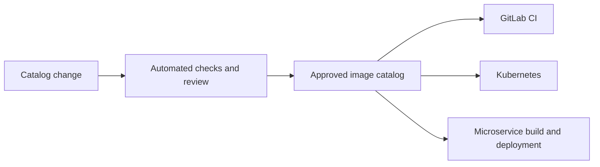

# Images Foundry

Images Foundry is a single source of truth for container images that are approved for use across the software development lifecycle (SDLC).

## Problem

An SDLC contains several actors that use container images, including Kubernetes workloads, GitLab CI pipelines, and microservices. Today, each actor maintains its own image list and rules. This creates duplicated configuration, inconsistent versions, unclear ownership, and no reliable way to answer a basic question: **which container images are allowed in our systems?**

The current approach makes it difficult to:

- prevent unapproved or vulnerable images from being used;
- keep image versions consistent across environments and tools;
- understand where an image is used and who owns it;
- update or retire an image safely;
- audit image approvals and policy changes.

## Proposed solution

Images Foundry will provide one version-controlled catalog of allowed container images. Every image will have a canonical, machine-readable record containing its immutable digest, ownership, permitted use cases, lifecycle status, and relevant security metadata.

SDLC actors will consume or validate against the same published catalog instead of maintaining independent allowlists.



Images Foundry is a policy and inventory layer. It does not replace a container registry, CI platform, Kubernetes, or a vulnerability scanner.

## Goals

- Maintain one authoritative inventory of allowed container images.
- Identify deployable images by immutable digest rather than by mutable tag alone.
- Apply consistent image policy across CI, Kubernetes, and microservice workflows.
- Make every approval, update, deprecation, and removal reviewable and auditable.
- Support automated validation and straightforward integration with existing tools.
- Provide a controlled migration path when an approved image is replaced or retired.

## Non-goals

The initial solution will not:

- build or host container images;
- replace existing registries or deployment systems;
- perform vulnerability scanning itself;
- discover every image already running in the organization;
- manage application deployment configuration beyond image policy.

Images Foundry may integrate with build, registry, signing, and scanning systems to verify their results.

## Image record

Each approved image should include at least:

| Field | Purpose |
| --- | --- |
| `name` | Stable logical identifier used by people and integrations |
| `repository` | Fully qualified registry and repository path |
| `digest` | Immutable content digest of the approved artifact |
| `tags` | Optional human-friendly version labels |
| `allowedFor` | Approved use cases, such as `ci`, `build`, or `runtime` |
| `environments` | Environments in which the image may be used |
| `owner` | Team responsible for the image record |
| `status` | Lifecycle state: `proposed`, `approved`, `deprecated`, or `blocked` |
| `provenance` | Build, signature, or source information used during approval |
| `expiresAt` | Optional date after which the approval must be reviewed |
| `replacedBy` | Optional successor for a deprecated or blocked image |

Example:

```yaml
apiVersion: images-foundry/v1
images:
  - name: example-runtime
    repository: registry.example.com/platform/example-runtime
    digest: sha256:<immutable-digest>
    tags:
      - "1.2.3"
    allowedFor:
      - runtime
    environments:
      - development
      - staging
      - production
    owner: platform-team
    status: approved
```

Tags are useful for people, but enforcement must use the repository and digest because tags can be moved to different image contents.

## Approval and publication workflow

1. A contributor proposes a new image or a change to an existing record.
2. Automated checks validate the schema, confirm that the digest exists, and evaluate configured security policies.
3. The image owner and required security or platform reviewers approve the change.
4. The approved change is merged, creating an auditable history.
5. A deterministic catalog artifact is published for consumers.
6. Integrations refresh their local copy and begin reporting or enforcing the new policy.

Updates and removals follow the same workflow. Images should normally be deprecated before they are blocked so that consumers have time to migrate. Emergency blocking must remain possible for compromised or critically vulnerable images.

## Consumer behavior

### GitLab CI

GitLab CI should validate images used by jobs, build stages, and deployment definitions. A pipeline should clearly identify the unapproved image and the catalog entry or approval process needed to resolve the failure.

### Kubernetes

Kubernetes manifests should be checked before deployment and, where required, again through admission control. Production enforcement should reject images that are absent from the catalog, blocked, outside their approved environment, or referenced with a different digest.

### Microservices

Service build and deployment workflows should validate base images and runtime images against the catalog. Applications should not need a runtime dependency on Images Foundry merely to start serving traffic.

## Functional requirements

1. The catalog must use a documented, versioned schema.
2. Every approved image must have a unique logical name and an immutable digest.
3. Changes must be validated automatically before publication.
4. Consumers must be able to retrieve a complete, deterministic catalog snapshot.
5. Policy checks must explain why an image is allowed or denied.
6. The solution must support environment- and use-case-specific permissions.
7. Records must support approval, deprecation, blocking, expiry, and replacement.
8. All catalog changes must have an attributable audit history.
9. Integrations must be able to use a last-known-good snapshot during temporary catalog unavailability.
10. Exceptions must be explicit, time-limited, owned, and auditable.

## Security principles

- **Default deny:** an image is not allowed unless an applicable approved record exists.
- **Immutable identity:** policy decisions use the registry, repository, and digest together.
- **Verified provenance:** approval may require trusted signatures, builders, sources, and scan results.
- **Least privilege:** contributors, reviewers, publishers, and consumers receive only the access they need.
- **Protected publication:** consumers verify that catalog artifacts are authentic and have not been modified.
- **Fail predictably:** each integration documents whether unavailable or stale policy causes a warning or a hard failure.

## Minimum viable product

The MVP will include:

- a versioned catalog schema and example catalog;
- a validator that checks catalog entries and image references;
- automated checks for proposed catalog changes;
- a published, machine-readable catalog snapshot;
- GitLab CI integration;
- Kubernetes manifest validation;
- documentation for proposing, approving, deprecating, and blocking images.

Enforcement can begin in report-only mode to inventory violations, followed by gradual activation for selected projects and environments.

## Acceptance criteria

The MVP is complete when:

- the same catalog can validate image references from GitLab CI and Kubernetes;
- mutable tags alone cannot satisfy an enforced approval check;
- invalid, unknown, blocked, expired, or incorrectly scoped images produce actionable errors;
- a catalog update is reviewed, validated, published, and consumed without manually editing each integration;
- consumers can continue using a verified last-known-good catalog during a temporary publication outage;
- every effective policy decision can be traced to a catalog version and image record.

## Open questions

- Should catalog snapshots be distributed as repository files, signed artifacts, an API, or a combination?
- Which signing, provenance, vulnerability, and license policies are required for approval?
- Which environments begin with report-only checks, and which require immediate enforcement?
- How should existing image usage be inventoried and migrated?
- Who can approve records, emergency blocks, and temporary exceptions?
- What freshness limit is acceptable for a cached catalog?
- Is policy global, or can teams add stricter rules without weakening the central baseline?

